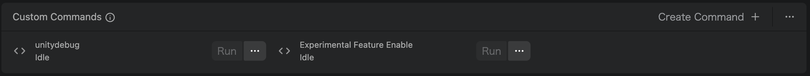

# 概要
食感再現VRアプリケーション「YummyVerse」のUnity側のリポジトリです。

# インストール方法

## 1. Unity HubとUnity Editorのインストール
Unity Hubをインストールし、Unity Editorのバージョン6000.2.0f1をインストールします

## 2. リポジトリのクローン
このリポジトリをクローンします。
安定して動くバージョンは最新のmainブランチにあります。

## 3. プロジェクトを開いてビルドする
Ctrl + Shift + B (MacOSの場合はCmd + Shift + B)でビルドウィンドウを開き、PlatformsをMeta Questに設定してBuildを押します。


## 4. Quest 3で実験的機能を有効にする
Meta Quest Developer Hubをインストールし、Quest 3をPCに接続します。
次に、左側のメニューから `Device Manager` を選択し、画面下部の `Custom Command` セクションの `Create Command` ボタンを押します。



`Name` には適当な名称を入力します。 `COMMAND` には、以下のコマンドを入力します。

``` 
adb shell setprop debug.oculus.experimentalEnabled 1
```

`Save` ボタンを押してコマンドを保存し、作成したコマンドの `Run` ボタンを押します。

## 5. アプリケーションのインストール
 `Add Build` ボタンを押して、ビルドしたapkファイルを選択します。
インストールが完了したら、アプリ名 `com.DefaultCompany.YummyTemplate` の左側にチェックマークが表示されます。

# 使い方
コントローラーのBボタン(右コントローラーにあります)がシーン切り替え用ボタンになっています。基本的には運営側が操作する想定です。
最初にアプリを起動すると、 `YummyVerse` と表示された真っ暗なシーンが表示されます。これが `タイトルシーン` です。
タイトルシーンでBボタンを押すと、パススルーが有効化されて現実世界が見えるようになります。これが `体験用シーン` です

体験者にQuest 3を被ってもらう前に、あらかじめ運営側で `体験用シーン` に遷移させてください。
1回の体験が終わったら、次の体験者に体験してもらう前に一度 `タイトルシーン` に遷移させた上で、`体験用シーン` に遷移させてください。

# トラブルシューティング
本アプリケーションは、アプリケーションが正常に動作していることを確認できるようにするため `体験用シーン` に遷移した際、UUID `7b998836-903e-4878-ae8e-839a2ef13373` のユーザーをYummyDB上に作成するようになっています。つまり、YummyDBが正常に稼働しているという仮定のもとで、本アプリケーションが正常に動いているならば、YummyDB側で以下のようなログが出力されるはずです。

`INFO:     192.168.8.225:48196 - "POST /create/user HTTP/1.1" 200 OK`

上のようなログが表示されない場合、以下の項目を確認してください。
<details><summary>上のログが出ない際の確認項目</summary>
 
## Quest 3がインターネットに接続しているか
Quest 3のWi-Fi設定を確認してください。

## APIエンドポイントの設定が間違っていないか
`Assets/FoodDB/Scripts/Model/TestFoodDBHandler.cs` の変数 ` private const string APIEndpoint` がAPIエンドポイントのURLになっています。URLが実際に運用されているサーバーのものと一致するかどうか確認してください。一致していなかった場合、この変数を正しいURLに変更して再び アプリケーションのビルドを行なってください。
</details>
