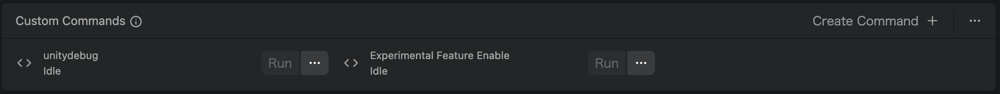
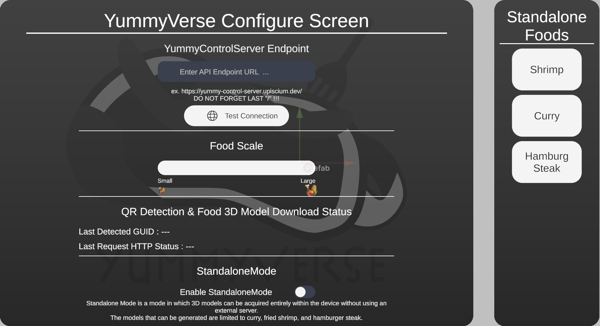

# 概要
食感再現VRアプリケーション「YummyVerse」のUnity側のリポジトリです。

# インストール方法

## 1. Unity HubとUnity Editorのインストール
Unity Hubをインストールし、Unity Editorのバージョン6000.2.6f2をインストールします。

## 2. リポジトリのクローン
このリポジトリをクローンします。
安定して動くバージョンは最新のmainブランチにあります。

## 3. プロジェクトを開いてビルドする
Ctrl + Shift + B (MacOSの場合はCmd + Shift + B)でビルドウィンドウを開き、PlatformsをMeta Questに設定してBuildを押します。

ビルドに必要なシーンは `Restaurant` シーンのみです。

## 4. Quest 3で実験的機能を有効にする

> [!WARNING] 
> <font color="Red">この作業はQuest 3を再起動するたびに行なってください</font>


Meta Quest Developer Hubをインストールし、Quest 3をPCに接続します。
次に、左側のメニューから `Device Manager` を選択し、画面下部の `Custom Command` セクションの `Create Command` ボタンを押します。



`Name` には適当な名称を入力します。 `COMMAND` には、以下のコマンドを入力します。

``` 
adb shell setprop debug.oculus.experimentalEnabled 1
```

`Save` ボタンを押してコマンドを保存し、作成したコマンドの `Run` ボタンを押します。

## 5. アプリケーションのインストール
 `Add Build` ボタンを押して、ビルドしたapkファイルを選択します。
インストールが完了したら、アプリ名 `com.DefaultCompany.YummyTemplate` の左側にチェックマークが表示されます。

# 使い方
## 食べる
初回は運営向け管理画面で Spatial Anchor と食べ物の表示位置を設定します。
設定後、QRコードを見つめると、そのGUIDに対応する食べ物が保存済みの位置へ表示されます。
QRコードは食べ物の選択にだけ使用し、表示位置と回転には使用しません。

## 咀嚼計(シリアル接続)
開口・閉口を検知するハードウェア「咀嚼計」を USB シリアルで接続すると、噛むたびに咀嚼音が鳴ります。
通信仕様は [`YummyVerse_Serial_Protocol_v1.0.md`](./YummyVerse_Serial_Protocol_v1.0.md) (115200 8N1 / LF終端) に準拠します。

- COMポート番号の設定は不要です。アプリはアクセスできるポートへ順に `HELLO,YUMMYVERSE,1` を送り、
  `READY,YUMMYVERSE,1,CHEWING_SENSOR` を返したポートを咀嚼計として採用します。
- 抜き差ししても自動で再探索します。咀嚼計が無くても他の機能はそのまま動作します。
- スタートボタンを押した直後に、来場者ごとのキャリブレーションが入ります。
  「口を動かさないでください」→ (受理から5秒後)「もぐもぐしてください」→ 完了で「YummyVerse へようこそ」へ進みます。
  咀嚼計が繋がっていない・失敗した場合はキャリブレーションを飛ばして先へ進みます。
- 咀嚼音は `MOUTH,OPEN` / `MOUTH,CLOSED` のどちらでも鳴ります。再生中に次の信号を受けたら頭から鳴らし直します。

> [!NOTE]
> シリアル通信は Windows / macOS / Linux のみ対応です。Quest 単体実行(Android)では咀嚼計なしとして動作します。

### 設定
`Assets/YummyVerse/Data/ChewingSensor/ChewingSensorConfig.asset` で調整します。

- `Chew Sound` … 鳴らす咀嚼音。**未設定だと音が鳴りません。**
- `Port Probe Timeout Seconds` / `Hello Retry Interval Seconds` … ポート探索の粘り強さ。
- `Calibration Completion Timeout Seconds` … `CAL_DONE` を待つ上限。センサー側の最大処理時間に合わせてください。

案内の文言と「もぐもぐしてください」への切り替え秒数は
`Assets/YummyVerse/Data/Tutorial/TutorialConfig.asset` にあります。

## 食べ物を破壊する
右手コントローラーの `B` ボタンを押すことで、現在シーンに存在する食べ物を破壊することができます。

## 【運営向け】管理画面
　2026年2月の更新で管理画面がつきました。管理画面はコントローラーの `A` ボタンを押すことで表示できます。



- `YummyControlServer Endpoint` には、Yummy Control ServerのエンドポイントのURLを入力します。URLの末尾に `/` を入れるのを忘れないようにしてください。また、` Test Connection` ボタンを押すと、エンドポイントの直下に `GET` リクエストを送信し、10秒以内にアクセス結果が表示されます。

- `Food Scale`は食べ物の大きさを調整できます。食べ物が大きすぎる、小さすぎる場合に利用してください。

- `Set / Update Spatial Anchor` は、水色の設定用Cubeの現在位置へ展示基準となるSpatial Anchorを作成して保存します。周囲が十分に見える明るい場所で実行してください。

- `Lock Food Position` は、コントローラーのGripで移動した設定用Cubeの位置を食べ物の表示位置として固定します。先にSpatial Anchorを設定する必要があります。Anchor UUIDとAnchorからの相対位置は端末へ保存され、次回起動時に復元されます。

- `QR Detection & Food 3D Model Download Status` では、Quest 3が認識したQRコードに書かれているGUIDと、直近の食べ物の3Dモデルのダウンロードリクエストの成否(表示内容はHTTP Status Code準拠)が表示されます。後述する `StandaloneMode` 時には、ファイル読み込み結果が表示されます。

- `Standalone Mode` を有効にすると、Yummy Control Serverに依存せずに事前に用意した食べ物を表示することができます。また、画面右側に `Standalone Foods` ウィンドウが表示されます。

  - `Standalone Foods` ウィンドウでは食べ物の名前が書かれたボタンを押すことで、食べ物を表示することができます。

> [!NOTE]
> `Standalone Mode` でも通常モードと同じ保存済みSpatial Anchor位置を使用します。表示位置を決めるためのQRコードは不要です。

> [!WARNING]
> StandaloneModeでは、Quest 3上の `storage/emulated/0/Android/data/com.DefaultCompany.YummyTemplate/TestData` 内から以下の3つのファイルを参照しています。(余談ですが、このパスがUnityにおける `Application.PersistentDataPath` 内の`TestData` フォルダです。)
> - `curry.glb`
> - `shrimp.glb`
> - `hamburg.glb`
> - `dragonsteak.glb` (2026/3/2 の更新で新規対応しました)
>
> **これらのファイルが配置されていない場合、StandaloneModeは動作しません！！！！**
>
> 2026/2/21 時点で、ファイルの転送は `adb` コマンドを使った方法が利用可能であることを確認しています。

# トラブルシューティング
## 確認項目( `StandaloneMode` が無効)
1. Quest 3はインターネットに接続されている？
  - インターネットに接続されていない場合は接続してください。

2. エンドポイントは正しく設定されている？
  - 有効なエンドポイントを設定してください。

3. `Test Connection` 結果は `Reached Host` かつ `Status : OK` になっている？
  - `Not Reached Host`の場合、サーバーまでのネットワークに何らかの問題があります。`Reached Host` でありながら `Status : OK` でない場合、エンドポイントのURLが誤っているか、サーバーに何らかの不具合が生じています。 (ここの原因の切り分けは、詳しい人に `Status` の内容を見せながら臨機応変に対応してください。)

4. `Last Detected GUID` が読み込んだQRコードの値に更新されているか？
  - `Last Detected GUID` が更新されない場合には、Quest 3の実験的機能が有効化されていない可能性があります。 `4. Quest 3で実験的機能を有効にする` の章を参考に、ADBコマンドで実験的機能を有効化してください。

5. 管理画面のSpatial Anchor状態が `Food position is fixed` または復元完了になっているか？
  - 未設定の場合は、水色のCubeを希望位置へ置いて `Set / Update Spatial Anchor` を押し、必要に応じてCubeを移動してから `Lock Food Position` を押してください。
  - 保存に失敗する場合は周囲を見回して空間情報を増やし、照明を確認して再実行してください。

## 確認項目( `StandaloneMode` が有効)
1. `.glb` ファイルが所定のディレクトリに配置されているか？
  - `【運営向け】管理画面` の後半のStandaloneModeの説明を読んでください。

---
最終更新 : 2026/8/30

更新者 : Inoyu
